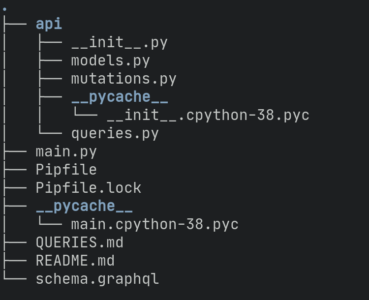

# Understanding GraphQL - Part II

In our last article, we talked about the origins of GraphQL and basic concepts 
related to it.

Today we will refresh the last content and we will learn a few new things putting 
hand on practice through a project built using Python 3, Ariadne, Flask, SQLAlchemy
and MySQL.

## The project
The source code for this project can be found [here](https://github.com/kno3comma14/graphql_tutorial) 
and you are free to clone, fork, and share the project for any purpose. 

This is a project thought as a guide to present a little bit of GraphQL, so we will need
a few requisites listed below:
- **Python 3.8.6** or superior: Our programming language.
- **Pip**: We need this to install Pipenv.
- **Pipenv**: Using Pipenv we will install all the required dependencies for the project.
- **MySQL**: We will need to create a MySQL schema and optionally use any MySQL client to interact with this RDBMS.

The dependencies required for this project include:
- **Ariadne**: Library used to implement GraphQL APIs
- **SQLAlchemy**: This is an easy-to-use but powerful ORM.
- **Flask**: We are using it to deal with our request-response life-cycle.

#### Structure
Our [graphql_tutorial](https://github.com/kno3comma14/graphql_tutorial) project has the structure shown
in the image below:


Let's talk about the most relevant components included in this structure:

- Pipfile: This is used by Pipenv to manage the dependencies included in the project.
- main.py: The entry point of the project
- schema.graphql: This file contains the definitions of all the types used in our GraphQL API. We will
learn more about the structure of this file in future sections of this post. 
- api/models.py: In this module, we have the classes that describe the data to be mapped between our code and 
our database.
- api/queries.py: This module contains the query operations from our graphql api.
- api/mutations.py: mutations module contains the query operations from our GraphQL API.
- api/__init__.py: Contains the base configuration needed by our project.


## Going back to the concepts
In the last section of this post, we will read about two new concepts from GraphQL, queries, and mutations. Let's define
these concepts so we can improve the understanding of the project.

#### Queries
At GraphQL queries are the way that we use to collect data from our API. This is one of the most important features of
GraphQL so we really need to understand it. In this post, we will try to explain queries using the 
[schema.graphql](https://github.com/kno3comma14/graphql_tutorial/blob/master/schema.graphql) file as support.

First, we need to define the queries using the type syntax we saw in the last post:

```graphql
type Query {
  wallets: WalletsResult!
  wallet(walletId: ID!): WalletResult!
}
```

In this code we are creating a Query type with ```type Query``` notation, so GraphQL will know where to find our query operations. Inside
this type we have two fields: ```wallets``` and ```wallet```. These fields are the name of our query operations. 

As we can see, ```wallets``` operation will return a ```WalletsResult``` type and ```wallet``` will return a ```WalletResult```, let's
look at the definition of these two types:

```graphql
type WalletResult {
  success: Boolean!
  errors: [String]
  wallet: Wallet
}

type WalletsResult {
  success: Boolean!
  errors: [String]
  wallets: [Wallet]
}
```

These two types are similar but ```WalletResult``` will receive only one ```Wallet``` object and ```WalletsResult``` will receive an array of ```Wallet```
as the base type. Now, we are talking about the ```Wallet``` type, so let's take a look:

```graphql
type Wallet {
  id: ID!
  name: String!
  currency(currency: CurrencyUnit = USD): String!
  coins: [Coin]
}
```

For the Wallet type, we have 3 fields: id, name, currency, and coins. ```id``` is an ID type, ```name``` is a String type, ```currency``` is a String type with a CurrencyUnit parameter, and ```coins``` is an array of Coin type. The Coin type is present in the [schema.graphql](https://github.com/kno3comma14/graphql_tutorial/blob/master/schema.graphql) file if you want to explore it.

To wrap all this explanation, we have to see this like a design process defined as: 
*create ```domain``` types* => *create ```result``` types* => *create ```representation``` types*

This process is pretty similar to the process used to develop our applications.

To end this section, please remember that query types are used to fetch some data, filter it, etc. For other operations such as create, modify 
or destroy data we will use **Mutations**. 

#### Mutations
If you have given a look to [schema.graphql](https://github.com/kno3comma14/graphql_tutorial/blob/master/schema.graphql) file, you probably noticed that
there is a type named Mutation and guess what? It contains the definitions for our mutation operations.

The mutations are related to create, update or delete specific API entities.

In our case, the [schema.graphql](https://github.com/kno3comma14/graphql_tutorial/blob/master/schema.graphql) file contains the following
definition:

```graphql
type Mutation {
  createWallet(name: String!, currency: String!, coins: [Int]): WalletResult!
  deleteWallet(walletId: ID!): DeleteWalletResult!
  addNewCoinToWallet(walletId: ID!, coinId: ID!): WalletResult!
}
```

In this definitiion we have 3 defined operations: ```createWallet```, ```deleteWallet``` and ```addNewCoinToWallet```. 

Important to remember!!! Mutations are related to create, update or delete entities from our API. We can infer that ```createWallet``` is a CREATE
operation, ```deleteWallet``` is a delete operation and ```addNewCoinToWallet``` is an UPDATE operation.

Please feel free to explore these definitions by yourself because I think it's time to start linking all this information 
with the source code.


## To the project again!
I think we have learned the basics of GraphQL type system, now it's time to put all this knowledge in the right place, our project!

Our chosen library for the GraphQL part of this project is named Ariadne. The main reason for this choice is the *Schema First* feature because
we want to understand how to use the type system provided by GraphQL. After we have a well-defined schema then we will have to create
the relationship between the types that we have created and the business logic. The way to accomplished this is using **resolvers**.

#### Resolvers
The two modules we have created as resolvers are ```queries.py``` and ```mutations.py```. In ```queries.py``` we have fetching operations, let's
check the source code:

```python
from api.models import Wallet

from ariadne import convert_kwargs_to_snake_case


def fetch_wallets(obj, info):
    try:
        wallets = [wallet.to_dict() for wallet in Wallet.query.all()]
        payload = {
            "success": True,
            "wallets": wallets
        }
    except Exception as error:
        payload = {
            "success": False,
            "errors": [str(error)]
        }
    return payload


@convert_kwargs_to_snake_case
def fetch_one_wallet(obj, info, wallet_id):
    try:
        wallet = Wallet.query.get(wallet_id)
        payload = {
            "success": True,
            "wallet": wallet.to_dict()
        }
    except AttributeError:
        payload = {
            "success": False,
            "errors": [f"Wallet item matching id {wallet_id} not found"]
        }

    return payload
```

The first new thing here is the decorator ```convert_kwargs_to_snake_case```, which makes the conversion from kwargs to snake case for a given function.
This is important because ariadne compares these arguments with the arguments from the GraphQL schema.

In the source presented, we can see two different methods: ```fetch_wallets``` and ```fetch_one_wallet```. ```fetch_wallets``` returns all the wallets
existent in the database and ```fetch_one_wallet``` returns one wallet given the wallet id. I hope you remember this code:
```graphql
type Query {
  wallets: WalletsResult!
  wallet(walletId: ID!): WalletResult!
}
```
It is from the ```schema.graphql``` file and I am taking it back because we have to notice that the argument of the field ```wallet``` is named
walletId, so this is the snake case version of the wallet_id argument.

The rest of the code is almost the same sequence of steps:
- Interact with the database using the models.
- Transform model objects into a dictionary named payload
- Handle exceptions of the whole process.

The analysis of the code from ```queries.py``` module is similar to the code exposed in ```mutations.py``` module, so we encourage you to study
this code by yourself.

Note: We recommend adding a step here for input validation purposes. We didn't include this step for simplicity reasons. Remember the main focus here
is the GraphQL topic.

#### The development flow
When we were thinking about how to design this sample application, we decided to create the following flow:
- Schema design(output: schema.graphql file).
- Resolvers development(output: queries.py and mutations.py files).
- Resolvers binding.

The resolver binding phase of the flow is done in the ```main.py``` module but we recommend separating it if your application is bigger than this one.

## Summary
In this section, we tried to complete the basic theory need to understand a GraphQL API. We covered queries, mutations, and resolvers. We explained 
the most important parts of our sample code so you will have a better understanding of the structure.

You can get the sample code at this [link](https://github.com/kno3comma14/graphql_tutorial) and if you have any questions please don't hesitate to contact
me via [@enyert](https://twitter.com/enyert), leave a comment [here](https://github.com/kno3comma14/graphql_tutorial) or send me an email to 
enyert.vinas@gmail.com.

I hope you enjoyed the reading.

Happy hacking!
