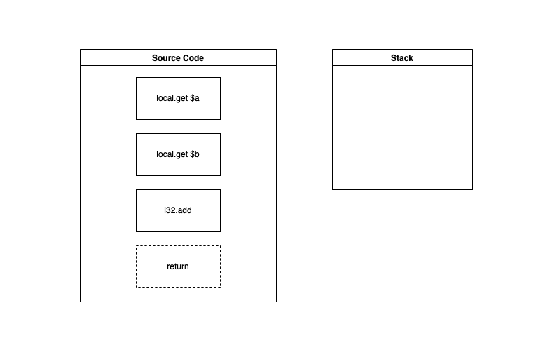

# WASM Part I: What is WebAssembly? Reasons to take it seriously
This article is the beginning of a series of two more posts that describes what is [WebAssembly(WASM)](https://webassembly.org/), the importance of this technology, and a simple [ClojureScript](https://clojurescript.org/) example running [WASM](https://webassembly.org/). On completion, the reader should understand the basic
concepts related to this topic, will know the importance of [WASM](https://webassembly.org/) in the actual web, and will be capable of running
a simple application using ClojureScript|WAT|WASM.
## The traditional web
The majority of the web is running using the traditional architecture, by traditional we mean
a web browser sending requests to a server via http/s. This web browser uses HTML and CSS to render content and *delegate to JavaScript* the responsibility to manage the behavior of these components and the
interaction between the browser and the internet via the request-response life cycle. That's it, plain
and simple. 
## So, this scenario is working at the moment. What is the problem?
The problems with the traditional web are the limitations of the browser as interpreter/compiler(Depending
on the technology implemented by the browser) and renderer at the same time. In general, the performance of
JavaScript running resource-intensive applications like video editors, 3D games, and so on, is far away to
compete with the native performance. 
Remember JavaScript was designed for humans and contains rules and redundancy that must be checked by the browser to run the source code. 
## How to solve this problem? 
One of the many solutions for this problem could be the inclusion of a new lower-level language with a compact
binary format to run alongside JavaScript. In this way, we could use this language to develop near-native
performance features.
## WebAssembly, time to raise!
Having these ideas in consideration, [WebAssembly(a.k.a WASM)](https://webassembly.org/) was launched in 2017 as a [binary instruction format](https://webassembly.github.io/spec/core/binary/index.html)
for a **stack-based virtual machine**. We know this definition is almost the same shown at [webassembly.org](https://webassembly.org/)
so let extend a little bit more this explanation. Let's start with **binary instruction format**, this one is simple
because it represents the way [WASM](https://webassembly.org/) exposes instructions to the computer to be processed. On
the other hand, we have a **stack-based virtual machine** which stores the instructions from WASM files in memory
using a stack as the main structure(We will talk more about this later in this post).
Now that we are understanding a little bit more the concept of WebAssembly, so let's continue with the benefits this technology brings to us.
### Main goals of WebAssembly
Like any other technology on the web, WebAssembly has been created thinking about some specific goals in mind. We are
presenting these goals differently as follows:
- Security: WebAssembly provides a secure sandboxed virtual machine. This means that we can WASM code from any web application
without thinking about intrusions over our personal computers or servers. Proof of this point is any of the most used browsers
on the web have its support enabled by default because they are confident about the security provided by WASM.
- Fast execution: WASM is compiled into a binary format that will be executed at a low level. In this way, we will deliver
near-native performance execution times. The format used by WASM is very compact so the browser can parse it as fast as possible.
The translation of a [WebAsembly](https://webassembly.org/) module to a native code can be cached by the browser. In this way, the
next time we load a page that contains a module, there will be virtually no load time.
- Portability: Three of the promises of WASM are Hardware/Language/Platform independence. This principle implies portability
for these three different factors. In the example presented in this post, we are generating a module made with ```wat2wasm``` tool in one
folder of our system. Then we can use the same *.wasm file in our ClojureScript project without any problem at all.
A valuable note for the reader could be a list of different languages that compile to WebAssembly, if you want this resource, please go to this [link](https://github.com/appcypher/awesome-wasm-langs).
### How WebAssembly works?
We have already given you a brief description of multiple aspects around WebAssembly, now we will explain how it works. First, we will introduce
the general process describing any step of the development life cycle.
After this explanation, we will show you all the development life cycle using two different practical examples:
1) Using wat => WASM, we will write some code using a textual representation named **wat** and will compile it to WASM.
2) Using Rust => WASM, we will write some code using [Rust](https://www.rust-lang.org/) and will compile to WASM as well. This part will be covered in the [next post]()
because we will solve a more difficult problem.
### The future!
[WebAssembly](https://webassembly.org/) is one of the most exciting technologies to learn on the web at the moment and the main
reason for this is the bigger ambition around being an alternative output format for any compiler that targets native code. 
Another aspect to take into consideration is that [WASM](https://webassembly.org/) is already integrated with a great part of the web 
platform. So, it is a natural chain reaction to use JavaScript and WebAssembly modules in conjunction. In this way, we can empower JavaScript with cross-compiled features from native code and get results as if it were part of the browser itself.
Big projects such as [Figma](https://www.figma.com/), [Lichess](https://lichess.org/), [Jitsi](https://jitsi.org), and a other
ones are using [WASM](https://webassembly.org/) for interesting use cases. So it's a great opportunity to learn about this
technology and adopt it if we have any use case to be solved with it.
### General development life-cycle
The development life-cycle for any WASM application follows a common set of steps. In the following lines, we will mention
and explain every step of this process.
1) Source code implementation: For the implementation of the source code we can select any language that will be available
to compile to WASM.
2) Compilation phase: We will compile the source code to WASM using a compiler such as [Emscripten](https://emscripten.org/) or [Cheerp](https://leaningtech.com/cheerp/).
3) Execution phase: The execution phase will run **wasm** extension files as binaries. 
## Time to practice!
We presented you a brief introduction to WebAssembly, how it works, and the general development life cycle. Now it's time
to apply all this stuff in practice. Let's start with our first example: **Wat to WASM!**
### Wat to WASM!
In this example, we will be using the WASM textual representation known as **Wat**. With this format, the code can be read
by humans but it's not the best option for larger applications. With this example, we want to show you that **WASM** applications
could be made even without a sophisticated setup or any famous programming language existent out there.
#### Setup
First of all, we will need [CMake](https://cmake.org/) because it is a pre-requisite to install [The WebAssembly Binary Toolkit or WABT](https://github.com/webassembly/wabt). In
macOS is easy to install, we just need to run ```brew install cmake``` and wait for the installation to be completed. In Linux [CMake](https://cmake.org/) probably
will exist in many different package managers so it could be something like ```sudo apt-get install cmake``` for Debian/Ubuntu users or the substitution of ```apt-get```
by any of your package managers. For Windows users, please follow these [instructions](https://cmake.org/install/).
After the installation of CMake we will need to install [The WebAssembly Binary Toolkit or WABT](https://github.com/webassembly/wabt). To do this,
we need to clone the git repository using the following commands:
1) ```git clone --recursive https://github.com/WebAssembly/wabt```
2) ```cd wabt```
3) ```git submodule update --init```
[WABT](https://github.com/webassembly/wabt) needs to use several submodules for some tests, that's the reason we are initializing and updating the submodules.

Now, we need to run the following instructions to build [WABT](https://github.com/webassembly/wabt):
1) ```mkdir build```
2) ```cd build```
3) ```cmake ..```
4) ```cmake .```

After this step we recommend you to add the route for the ```bin``` folder to the ```$PATH```, in this way you don't have to put
the complete path to ```bin``` folder every time you want to execute any of the [WABT](https://github.com/webassembly/wabt) commands.
#### Time to code
Perfect, we have completed the setup, so now it's time to create our first *.wat file, compile it to a *.wasm file, and call it from Javascript.
First of all, create a project folder using the following command:
```mkdir my_first_project```
or you can use your favorite editor for this purpose as well. Inside this folder we need to create a wat file using our editor or this command:
```touch calc.wat```
In this file, we will create a simple calculator with only one operation, addition.
Open the ```calc.wat``` file in your favorite editor and paste or write the following code:
```clojure
(module
  (func $add (param $a i32) (param $b i32) (result i32)
    local.get $a
    local.get $b
    i32.add)
  (export "add" (func $add)))
```
This code is pretty simple, it takes two parameters ```a``` and ```b```, and calculates the sum of these values. But don't drink too much Koolaid, we have
to remember WASM as a **stack-based virtual machine**. With this idea in mind, we can describe the behavior of this operation in more details:
1) We have the ```module`` expression that contains the definition of the elements that belong to a specific module.
2) We are defining a function with the expression ```func```. In this case, is a function named add(The $add expression is more complex but keeps this simple at the moment).
3) We are defining some parameters with this function using ```param``` expression and we are defining types, ```i32``` for this particular case.
4) We are using the ```result``` expression to define the return value of the function.
5) ```local.get x``` takes a value and pushes it to our stack.
6) We use ```i32.add``` to calculate the addition of the two elements from the top of the stack and put the result at the top of the stack. 
7) We are exporting our function(Make it callable from external sources) using ```export``` expression)

In the following animation we can see how the add operation is working in WASM:


After completing this phase, the next one will be compiling to wasm. For this purpose we use the following command:
```wat2wasm calc.wat -o calc.wasm```
```wat2wasm``` takes the *.wat file to compile and uses the ```-o``` parameter to specify what is the **o**utput of the compilation for the *.wasm file. In our case,
we are using ```calc.wat``` as a source and the command will produce a compiled file named ```calc.wasm```.
### ClojureScript Glue
Most of the online tutorials focus on the usage of WASM for JavaScript. But we are from the Clojure/Script world, so we will use our compiled wasm code
in a simple ClojureScript project. For the next steps we will need to use [Leiningen](https://leiningen.org/), we will recommend you to install this tool
and follow the following instructions:
1) Create a simple ClojureScript project: Use this command ```lein new mies super-wasm-tutorial```. This will create a skeleton project using the template **mies**
inside a folder named **super-wasm-tutorial**.
2) Copy or move the wasm file to super-wasm-turorial folder.
3) Add the following code to the ```super-wasm-tutorial.core``` namespace:
```clojure
(ns cljs-test.core
  (:require [clojure.browser.repl :as repl]))

;(defonce conn
;  (repl/connect "http://localhost:9000/repl"))

(enable-console-print!)

(.then (. js/WebAssembly instantiateStreaming (js/fetch "calc.wasm"))
       (fn [obj] (js/console.log (obj/instance.exports.add 1 2))))
```
4) Use the command ```scripts/build``` to build the project.
5) Run a web server in the ```super-wasm-tutorial``` folder to serve to a port. For this tutorial, we used ```python3 -m http.server``` that will serve for requests
at http://localhost:8000.
6) Open a browser and go to http://localhost:<your_port> and use the console to see the console. If everything is ok, you will see a number 3 printed on the console.


## Conclusion
In this article, we talked about [WebAssembly](https://webassembly.org/) and explored the basic concepts and pillars
of this amazing technology. We also created a simple function to add two integers using WAT and we used the wasm file
with a ClojureScript project. In the next part of this series of articles, we will create a more complex application
using Rust and will compile the program to WASM. 

Happy Hacking!

Enyert Vinas is a software engineer at Flexiana(Using Clojure, Python, and other languages as his toolchain), game developer, and
musician. He is living in Medellin, Colombia.
